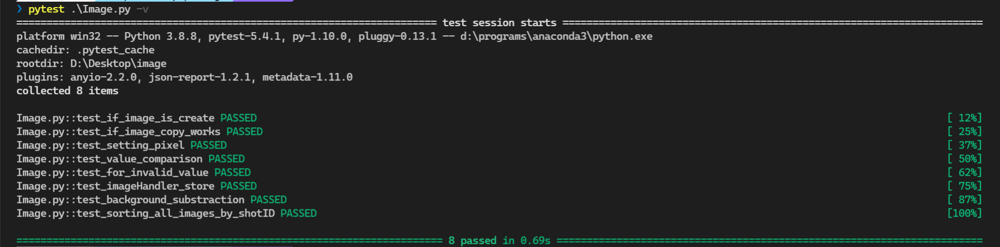

Development Environment:

platform win32 -- Python 3.8.8, pytest-5.4.1, py-1.10.0, pluggy-0.13.1 -- d:\programs\anaconda3\python.exe
cachedir: .pytest_cache
metadata: {'Python': '3.8.8', 'Platform': 'Windows-10-10.0.22000-SP0', 'Packages': {'pytest': '5.4.1', 'py': '1.10.0', 'pluggy': '0.13.1'}, 'Plugins': {'anyio': '2.2.0', 'json-report': '1.2.1', 'metadata': '1.11.0'}}

# Note: I have kept all the files for the program in one file because I was trying to match the pattern of the test to have only one file..But in development I will keep create separate files for Image , ImageHandler and for the pytest.

## Problem Statement:

This exercise should be completed in either Java, C#, python or C++. You should write mostly in the Interview Zen panel, but can paste the code back and forth from an IDE to check and run it. You can also refer to online resources to check functions calls etc. you may want to use.

## == ImageHandler Exercise == 

The lion’s share of data collected at the EPAC facility will be in the form of image data. Images can be thought of a linear array of intensity values (grayscale) so no colour information is stored. In order to distinguish the images we collect, we associate a shot id (in the future may introduce a time stamp). 

In this exercise you will model this situation by developing interfaces which would allow the creation and processing of such image data. For the purpose of this exercise we will treat the shot id and timestamp as unsigned 64-bit integers, and each pixel value (image intensity value) is an unsigned 32-bit value. 

## == Exercise 1 == 

Create an Image class which: 

\- Stores Image pixel data and its identifiers (either shotID or timestamp). 

The Image should be copyable and moveable (if possible) 

\- The width, height and image pixel data should be easily accessible (read only). (The size of the array is width*height to give you the number of pixels to be stored) 

\- The interface should also allow client code to fill the image pixel data with an arbitrary value in a performant way. 

\- Compare all image pixel values to a user defined value. 

Of course, creation should be resilient to garbage input from clients. 

Tips: 

\- Making the Image class directly iterable may be useful. 

\- Parallelising any for loops could speed things up but not necessary if too much work. 

\- Make use of the standard library where possible (C++ submissions). 

## == Exercise 2 == 

Create an ImageHandler class which stores a list of images. 

ImageHandler objects should allow client code to accomplish the following: 

\- Create and access (read-only where possible) a list of images whether identified by shotID or timestamp. (There should only be one ImageHandler class) 

\- Add or remove an image from the list in any position (front, back or some arbitrary insertion/deletion). 

\- Subtract background image from list of images. 

\- Sort images (by shot ID or timestamp). 

\- Return a list of shot IDs or timestamps. 

## == Exercise 3 == 

### Write a series of unit tests for the Image class to verify the following functionality: 

* Image creation 

* Copying an image 

* Setting pixel values 

* Value comparison 

### Write a series of unit tests for the ImageHandler class to verify the following: 

1. Store and verify the following three images with width=height=512 pixels: 

* Shot ID = 50, all pixel values = 100 

* Shot ID = 10, all pixel values = 70 

* Shot ID = 15, all pixel values = 20. 

2. Verify subtraction of background image which has all pixel values set to 7. 

3. Verify sorting all images by shot ID.
